<!-- Generated by scripts/render.mjs. Edit that, not this file. -->

<picture>
  <source media="(prefers-color-scheme: dark)" srcset="assets/hero-dark.svg">
  
</picture>

<picture>
  <source media="(prefers-color-scheme: dark)" srcset="assets/card-dark.svg">
  
</picture>

**[y49/tlive](https://github.com/y49/tlive)** — Self-hosted remote approvals + live monitoring for Claude Code / Codex — via Telegram, Feishu, or a web terminal. Any subscription or API key.

Merged upstream: [`langgenius/dify#27546`](https://github.com/langgenius/dify/pull/27546) · [`fawney19/Aether#270`](https://github.com/fawney19/Aether/pull/270)
